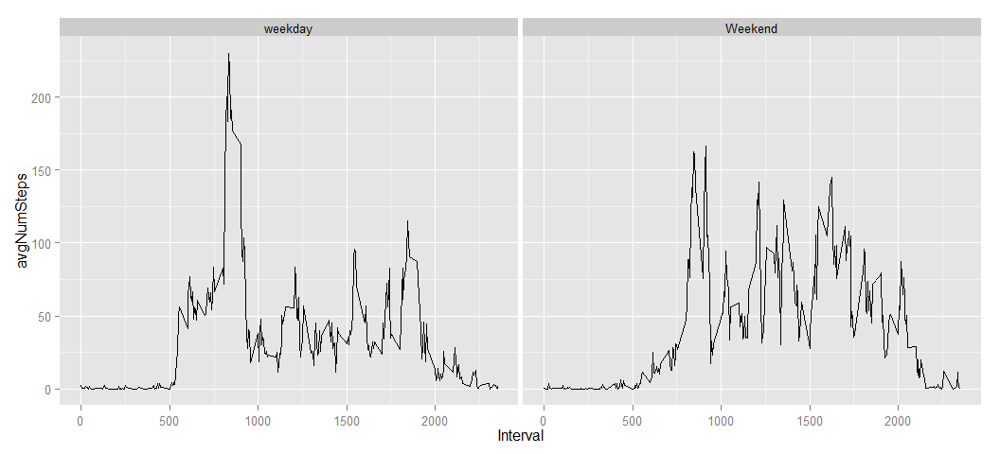

# Programming assignment 1
ljuba80  


## Loading and preprocessing the data


```r
data<-read.csv("activity.csv");
data1<-subset(data,!is.na(data$step))
data1$date<-as.character(data1$date)
```

## What is mean total number of steps taken per day?

```r
tot<-with(data1, tapply(steps, date, sum))
hist(tot,breaks=50,main="Total number of steps")
```

 

```r
mean(tot)
```

```
## [1] 10766
```

```r
median(tot)
```

```
## [1] 10765
```


## What is the average daily activity pattern?


```r
avgNSteps<-with(data1, tapply(steps, interval, mean))
plot(unique(data1$interval),avgNSteps,main="Avg daily activity",
     ylab="av # of steps",xlab="interval",col='red',lwd=0,type='n')
lines(unique(data1$interval),avgNSteps,col='red');
```

 

```r
#gives 206.1698 in 835
avgNSteps[avgNSteps==max(avgNSteps)]
```

```
##   835 
## 206.2
```


## Imputing missing values


```r
numOfMissingVal <- sum(is.na(data$steps) | is.na(data$interval))
numOfMissingVal
```

```
## [1] 2304
```


## Are there differences in activity patterns between weekdays and weekends?


```r
avgPerInt<-data.frame(steps=avgNSteps,intervals=unique(data$interval))
data$steps[is.na(data$steps)]=avgPerInt$steps
tot1<-with(data, tapply(steps, date, sum))
hist(tot1,breaks=50,main="Total number of steps - imputed missing values")
```

 

```r
mean(tot1)
```

```
## [1] 10766
```

```r
median(tot1)
```

```
## [1] 10766
```

```r
#adding new variable to data frame
#data<-cbind(data,data.frame(typeOfDay=weekdays(as.Date(data$date))))

data<-cbind(data,data.frame(typeOfDay=""))
levels(data$typeOfDay)<-c("weekday","Weekend")
data$typeOfDay[weekdays(as.Date(data$date))!=as.character("Saturday") & weekdays(as.Date(data$date))!=as.character("Sunday")]=levels(data$typeOfDay)[1]
data$typeOfDay[weekdays(as.Date(data$date))==as.character("Saturday") | weekdays(as.Date(data$date))==as.character("Sunday")]=levels(data$typeOfDay)[2]

ndf1<-subset(data,typeOfDay==levels(data$typeOfDay)[1])
avgNSteps<-with(ndf1, tapply(steps, interval, mean))
plot(unique(ndf1$interval),avgNSteps,main="Avg daily activity-weekday",
     ylab="av # of steps",xlab="interval",type="n")
lines(unique(ndf1$interval),avgNSteps,col="red")
```

 

```r
ndf2<-subset(data,typeOfDay==levels(data$typeOfDay)[2])
avgNSteps<-with(ndf2, tapply(steps, interval, mean))
plot(unique(ndf2$interval),avgNSteps,main="Avg daily activity-weekend",
     ylab="av # of steps",xlab="interval",type="n")
lines(unique(ndf2$interval),avgNSteps,col="red")
```

 

